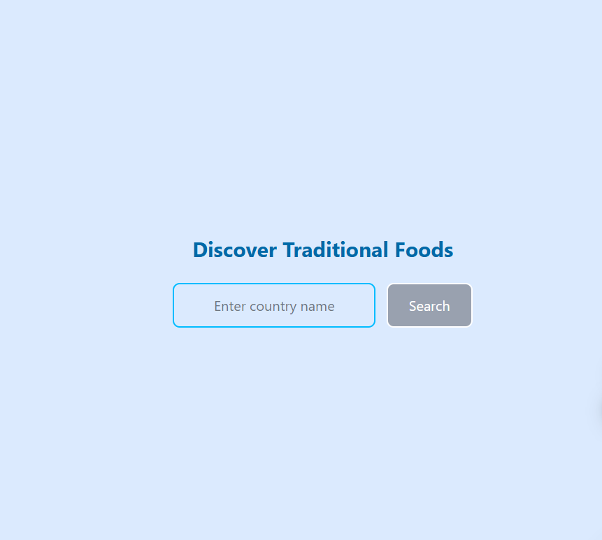

# <h1 align="center">Discover Traditional Foods</h1>

This a simple Discover Traditional Foods website.

## Technology Used

- **HTML5**
- **CSS**
- **JavaScript**

---

## Screenshot



---

## Project Structure

```
BAIUST_COMPUTER_CLUB/

├── Assignment3/
| ├── Home_Page.png
├──index.html
├──README.md
├──script.js
├──style.css
├──tailwind.config.js

```

---

## Built by

**Md Rakibul Hassan**

_Passionate Computer Science Junior_ [LinkedIn](https://www.linkedin.com/in/md-rakibul-hassan-miyaji)  
Email: rakibulhassan0327@gmail.com

## License

This project is open-source and free to use under the [MIT License](LICENSE).

---
